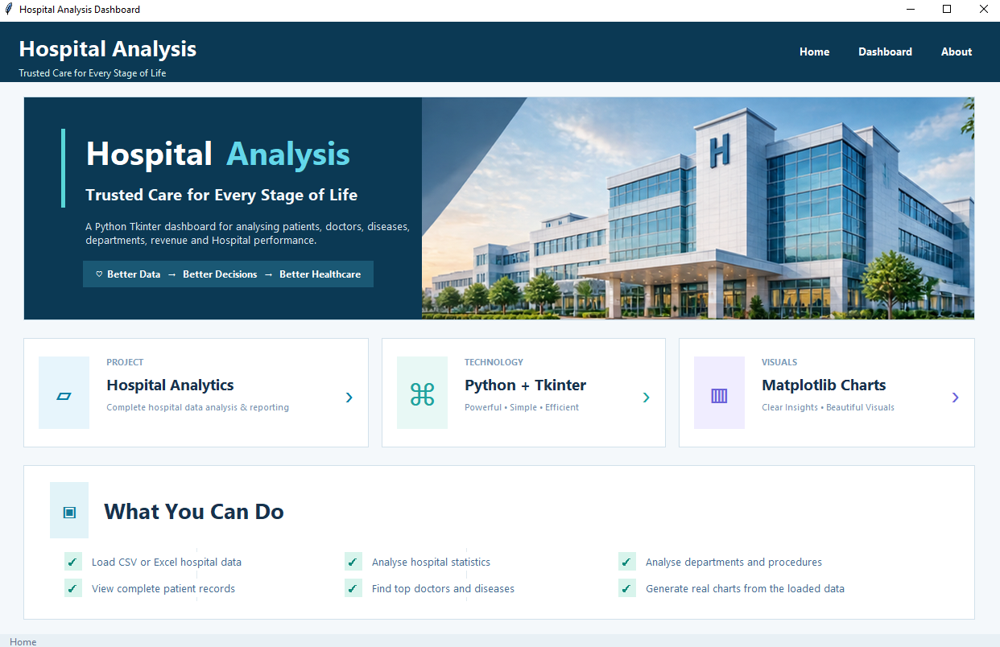
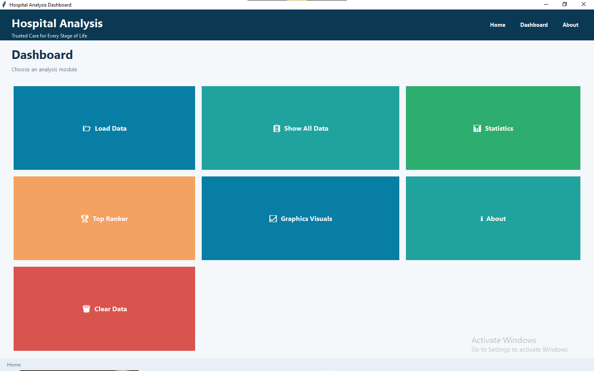
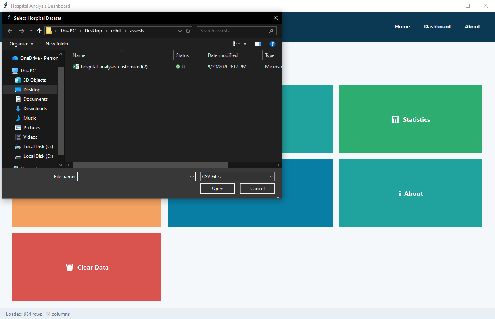
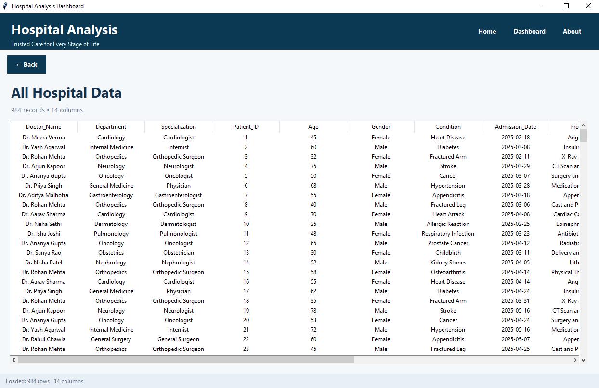
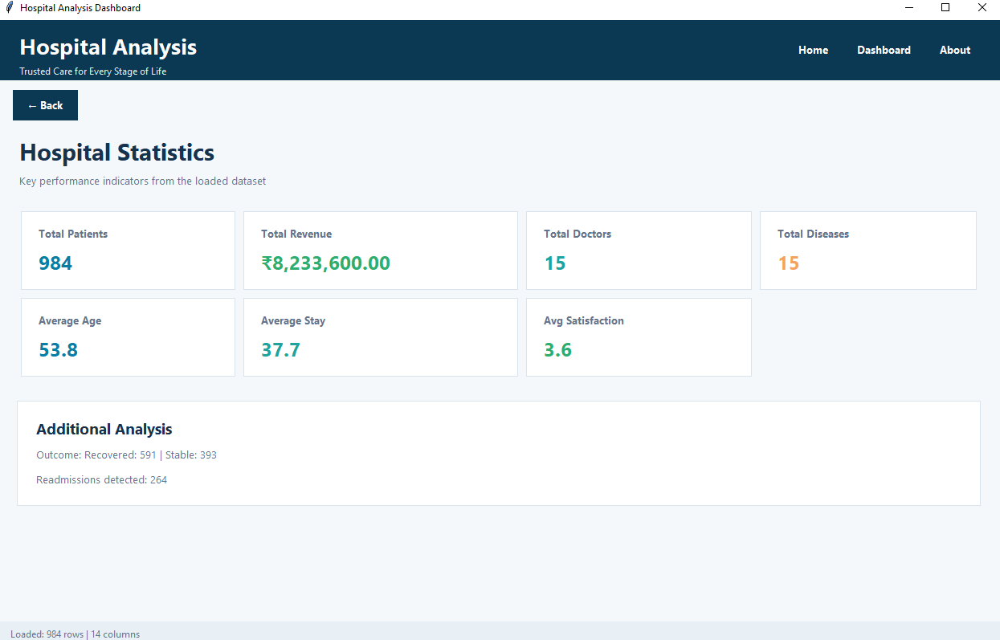
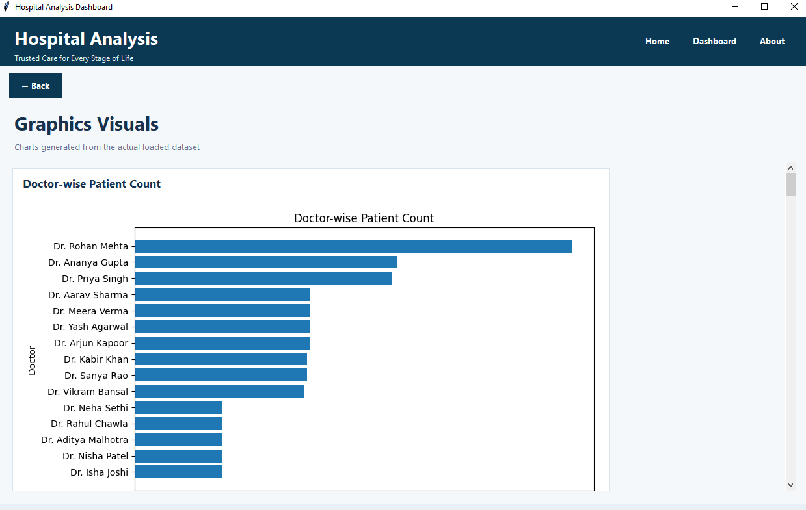
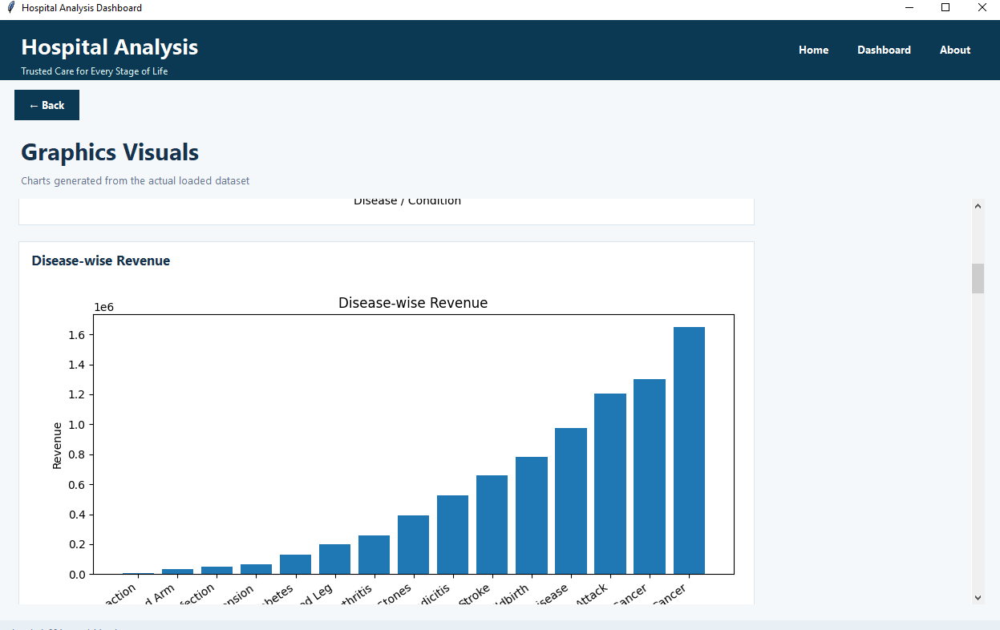
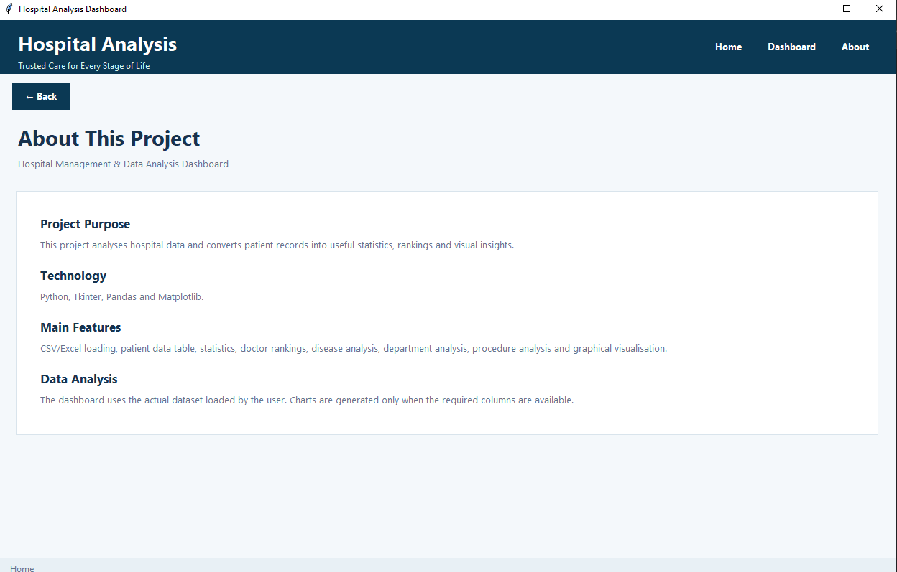

# 🏥 Hospital Data Science App

A Python-based desktop application for analyzing hospital data, generating insights, and visualizing healthcare performance.

## 📌 Project Overview

The Hospital Data Science App is designed to analyze hospital-related data and provide useful insights through an interactive graphical interface.

The application allows users to explore hospital data, view statistics, analyze doctor performance, and generate visual insights from the dataset.

## ✨ Features

- 📊 Hospital data analysis
- 👨‍⚕️ Doctor performance analysis
- 💰 Revenue analysis
- 🏥 Patient and disease analysis
- 📈 Data visualization
- 🔎 Data exploration and statistics
- 🖥️ Interactive desktop GUI
- 📂 CSV dataset integration
`
## 🛠️ Technologies Used

- Python
- Pandas
- NumPy
- Matplotlib
- Tkinter
- CSV

## 📂 Project Structure

```text
hospital-data-science-app/
│
├── MAIN.PY
├── hospital_hero.png
├── hospital_analysis_customized(2).csv
└── README.md
```

## ▶️ How to Run

### 1. Clone the repository

```bash
git clone https://github.com/ds-rohit01/hospital-data-science-app.git
```

### 2. Open the project folder

```bash
cd hospital-data-science-app
```

### 3. Install required libraries

```bash
pip install pandas numpy matplotlib
```

### 4. Run the application

```bash
python MAIN.PY
```
## 📸 Project Screenshots

### 🏠 Home Page


### 📊 Dashboard


### 📂 Load Data


### 🏥 Hospital Data


### 📈 Hospital Statistics


### 📉 Graphics Visuals


### 📊 Additional Graphics


### ℹ️ About Page

